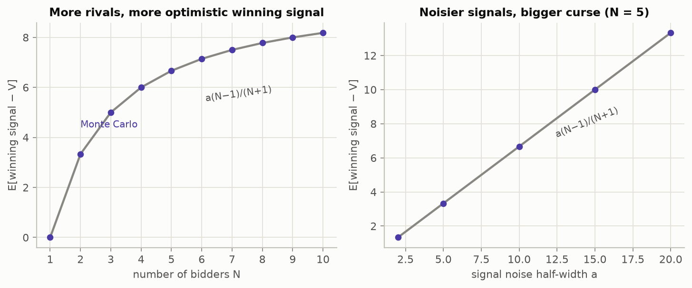
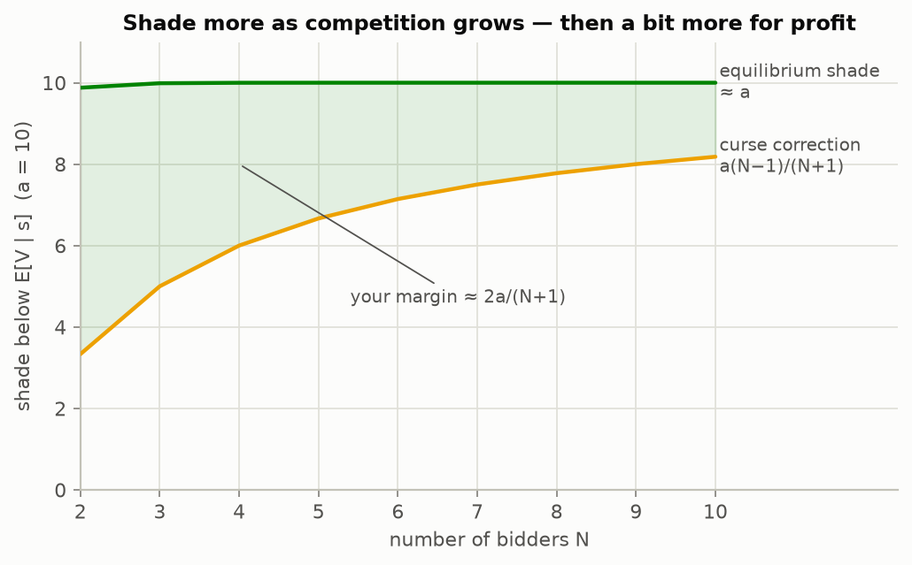
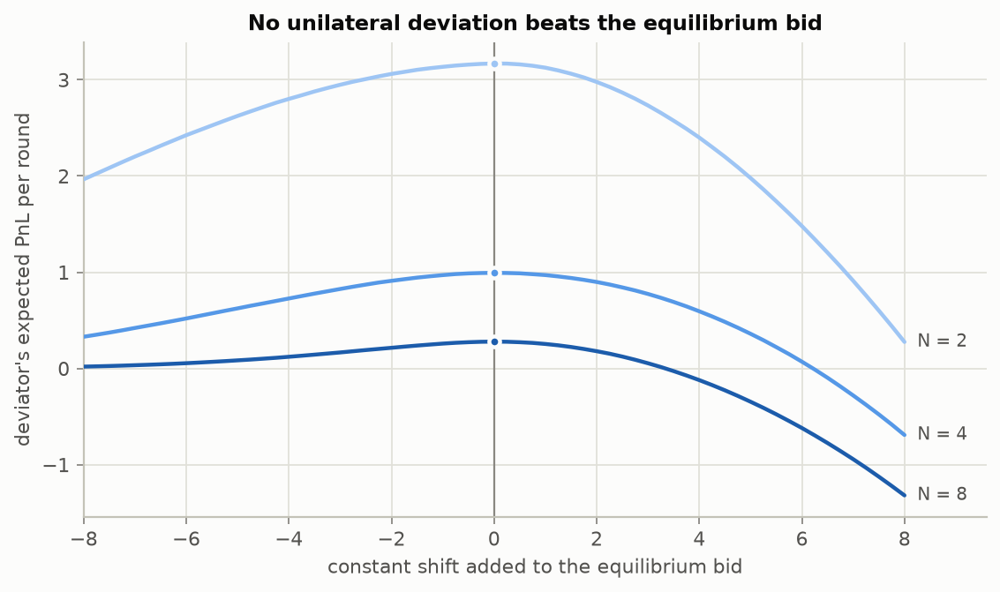
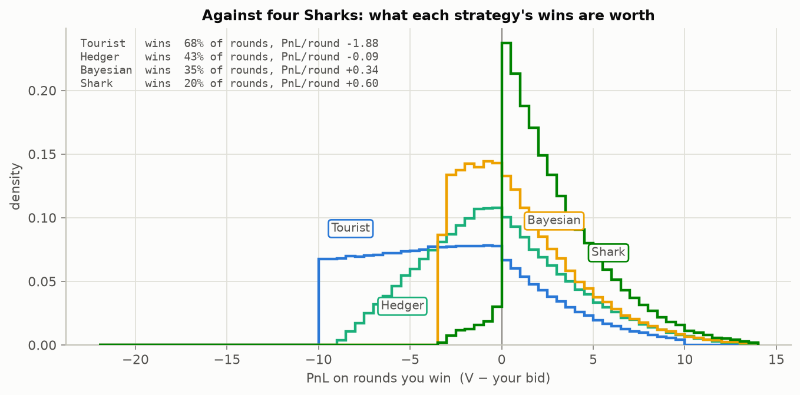
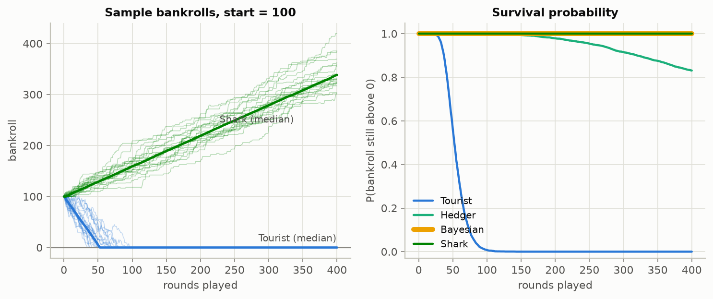
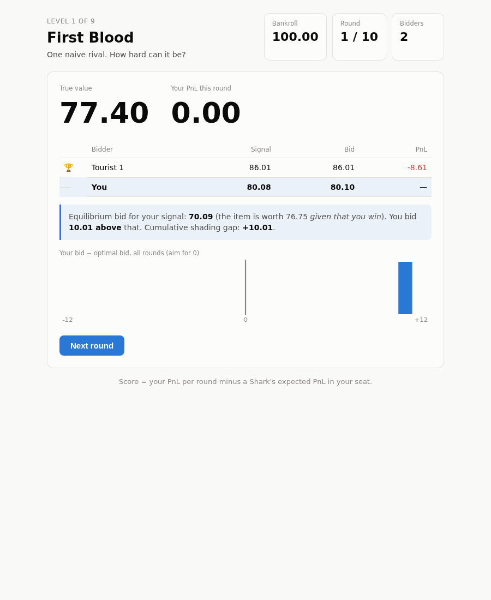
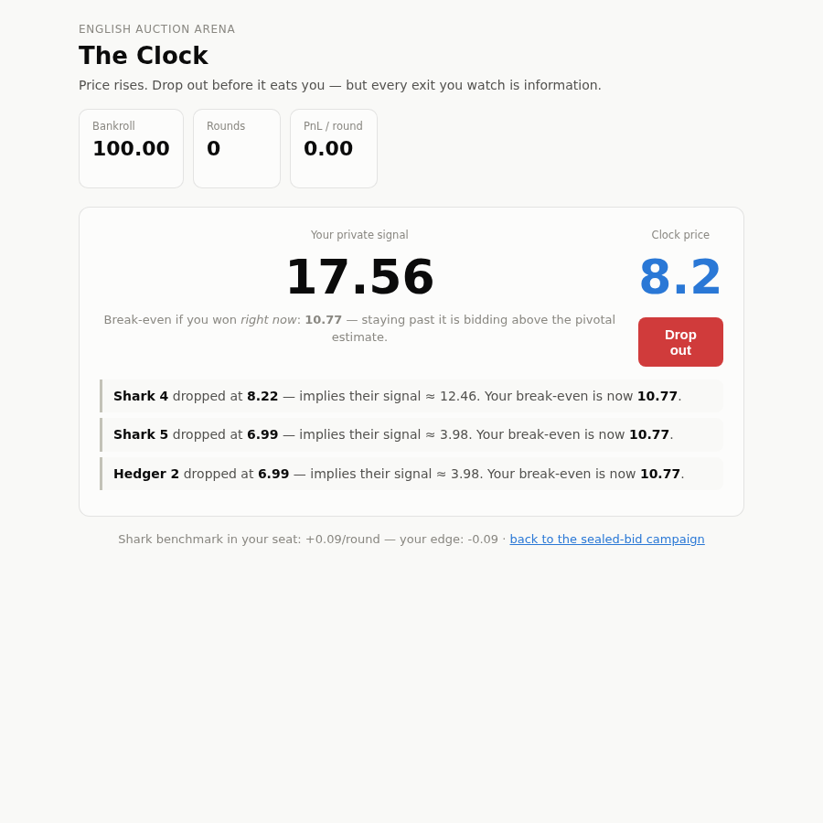
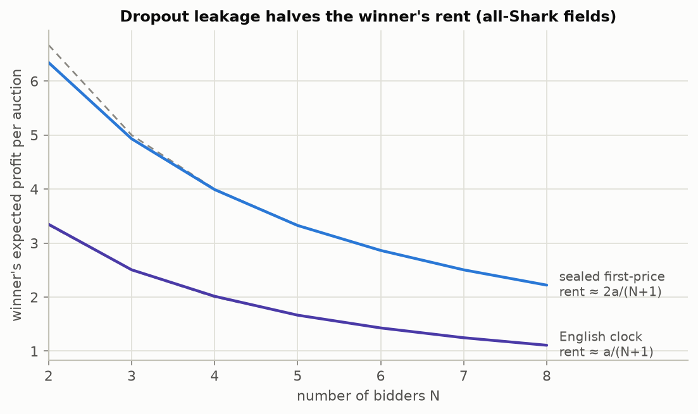

# The Winner's Curse — a common-value auction game

A game about the cleanest toy model of **adverse selection**: a sealed-bid auction for an
item whose true value nobody knows. Naive bidders bid close to their private estimate and
*consistently lose money* — and this project makes you feel why, then derives the fix, then
proves the fix is optimal by simulation.

> **The one-line lesson:** winning is information. If your bid was the highest of N, your
> estimate was probably the most optimistic of N — so the moment you win, the item is worth
> less than you thought. Anyone quoting prices in a market lives this daily: when your bid
> gets hit, it's disproportionately because someone knew something.

## The game

- An item has a true value **V ~ Uniform(0, 100)**, drawn fresh each round. Nobody sees it.
- Each of **N** bidders receives a private signal **sᵢ = V + εᵢ**, with **εᵢ ~ Uniform(−a, a)**
  and a = 10. The signal is an *unbiased* estimate of V.
- Sealed first-price auction: highest bid wins, pays their bid, and books **PnL = V − bid**
  (which can be negative). Then V is revealed, everyone sees the autopsy, repeat.

```bash
pip install -e .[dev]
pytest                     # unit + Monte Carlo property tests
```

## Act 1 — the naive intuition, and how it fails

"My signal is unbiased, so bidding a little under it should be fine." It is not fine.
You only pay when you **win**, and you win when your signal is the *highest* of N draws.
The highest of N unbiased estimates is not unbiased — it overshoots, by exactly

$$\mathbb{E}[s_{\max} - V] = a\,\frac{N-1}{N+1}$$

in the interior. More rivals or noisier signals make it worse:



With a = 10 and eight bidders the winning signal overshoots the truth by ~7.8 on average.
Bid your signal and that overshoot comes straight out of your pocket, every time you win.

## Act 2 — the fix is a conditional expectation

Don't estimate $\mathbb{E}[V \mid s_i]$. Estimate what the item is worth **given that you
are about to win**: $\mathbb{E}[V \mid s_i,\; s_i = \max_j s_j]$.

The derivation is three lines. Given V, your signal has density $\tfrac{1}{2a}$ on
$[V-a, V+a]$, and each rival lands below $s$ with probability $\tfrac{s - V + a}{2a}$.
With a flat prior on the interior, the posterior over V given "signal $s$, and it's the max
of N" is therefore

$$p(V \mid s, \text{max}) \;\propto\; (s + a - V)^{N-1}, \qquad V \in [s-a,\, s+a].$$

Substituting $u = s + a - V$ gives a density $\propto u^{N-1}$ on $[0, 2a]$, whose mean is
$\tfrac{N}{N+1} 2a$. So

$$\mathbb{E}[V \mid s, \text{max of } N] \;=\; s - a\,\frac{N-1}{N+1}.$$

That is the whole winner's curse in one formula: the correction **grows with N**. Against
one rival you shade a third of the noise band; against nine, over 80% of it. More
competition means you should bid *less* — the deeply counterintuitive part.
(The implementation in [`bayes.py`](src/auction/bayes.py) is exact including the boundary
truncation at 0 and 100, and is cross-checked against numeric integration in the tests.)

## Act 3 — the equilibrium adds a margin on top

Bidding the corrected estimate is *calibrated* — you no longer overpay — but you also make
nothing: against copies of yourself your expected PnL is exactly zero. The symmetric
risk-neutral Nash equilibrium (Wilson 1977; Kagel & Levin 1986) shades further. For
interior signals ($s \ge a$):

$$b(s) \;=\; s - a + \frac{2a}{N+1}\, e^{-\frac{N}{2a}(s - a)} \;\;\approx\;\; s - a .$$

Away from the low boundary you simply **bid as if your noise draw were maximally
optimistic**. The gap between the corrected estimate and the equilibrium bid is the
winner's information rent, about $\tfrac{2a}{N+1}$ per win:



## Act 4 — simulation evidence

**The equilibrium is a fixed point, not a hand-wave.** Hold everyone at $b(s)$, let one
bidder shift their bid by a constant, and estimate their EV over 10⁶ interior-conditioned
auctions with common random numbers. Every curve peaks at zero deviation
([`fig_best_response.py`](analysis/fig_best_response.py); the same check runs as a
`pytest -m slow` test):



**What each strategy's wins are worth.** Each bot plays against four equilibrium bidders
for 500k rounds. Conditional on winning, the naive bidder's PnL is centered around −5;
the curse-corrected bidder centers on zero; the equilibrium bidder gets paid:



**And the bankroll consequences.** Start with 100, play until ruin:



| Strategy | Bids | vs 4 Sharks: win rate | PnL / round |
|---|---|---|---|
| **Tourist** | its signal | 68% | **−1.88** |
| **Hedger** | E[V \| s] minus a flat 10% | 43% | −0.09 |
| **Bayesian** | E[V \| s, s = max] — calibrated, zero margin | 35% | +0.34 |
| **Shark** | the equilibrium b(s) | 20% | **+0.60** |

The Tourist "wins" the most auctions and loses the most money — that is adverse selection:
volume you attract by mispricing is exactly the volume that hurts you.

Regenerate everything with:

```bash
pip install -e .[analysis]
python analysis/run_all.py    # writes docs/figures/*.png (~1 min)
```

## Play the game

```bash
pip install -e .[web]
uvicorn web.app:app
# open http://127.0.0.1:8000
```

A nine-level campaign from one naive rival up to a table of eight equilibrium bidders. You
start each level with a bankroll of 100; going broke busts the level, finishing at a profit
advances you. The heart of the game is the **post-round autopsy**: everyone's signals and
bids, the true value, the equilibrium bid you *should* have made, and a running histogram
of your bid minus the optimal bid — you literally watch yourself learn to shade:



Beating a level unlocks its opponents' strategy descriptions, and your score is
luck-adjusted: PnL per round **minus what a Shark would be expected to earn in your seat**.

## Act 5 — the English auction, where information leaks

Open the **English arena** at `/english` in the running app: the
price rises on a clock, bidders drop out irreversibly, and the last one standing pays the
price at which the runner-up quit. Same value model, wildly different information game —
**every dropout price reveals a signal**. In the Milgrom–Weber equilibrium you stay in
exactly up to the *pivotal estimate*

$$\mathbb{E}\big[V \,\big|\, s,\ \text{remaining rivals tied at } s,\ \text{revealed dropouts}\big]
\;=\; \text{midpoint}\big(s - a,\ \min(s, s_{\text{lowest revealed}}) + a\big)$$

and equilibrium bidders can *invert* each exit price back to the leaver's signal and
re-solve on the fly. With no dropouts yet, the rule is just the posterior mean — the
ascending mechanism corrects the winner's curse **by itself**, no deliberate shading
required. That has a price-theory consequence: the seller captures the leaked information.



Revenue equivalence (which holds for *private* values) visibly breaks: in all-Shark fields
the sealed-bid winner keeps a rent of about $\tfrac{2a}{N+1}$, while the English winner
keeps only about $\tfrac{a}{N+1}$ — the leakage hands the other half to the seller (the
linkage principle):



In the arena autopsy you can compare each leaver's *inferred* signal with their *actual*
one: inference is exact for equilibrium bidders and systematically biased for the naive
ones — including for you, since the Sharks read your dropout as if you were one of them.

## Repo layout

```
src/auction/
  engine.py       # sealed-bid first-price rounds, seeded and reproducible
  bayes.py        # posteriors, the curse correction, the equilibrium bid (scalar, stdlib-only)
  vectorized.py   # numpy mirrors for Monte Carlo at scale (tested against the scalar versions)
  bots.py         # Tourist, Hedger, Bayesian, Shark
  campaign.py     # levels, pass rules, and the Shark score benchmark
  english.py      # ascending-clock auction: pivotal estimates, dropout inversion
analysis/         # scripts that produce every figure above
web/              # FastAPI backend + single-page game client (sealed campaign + English arena)
tests/            # unit, property, API and best-response tests
```

## References

- R. Wilson (1977), *A Bidding Model of Perfect Competition*.
- J. Kagel & D. Levin (1986), *The Winner's Curse and Public Information in Common Value Auctions*.
- P. Milgrom & R. Weber (1982), *A Theory of Auctions and Competitive Bidding*.
- R. Thaler (1988), *Anomalies: The Winner's Curse*.
